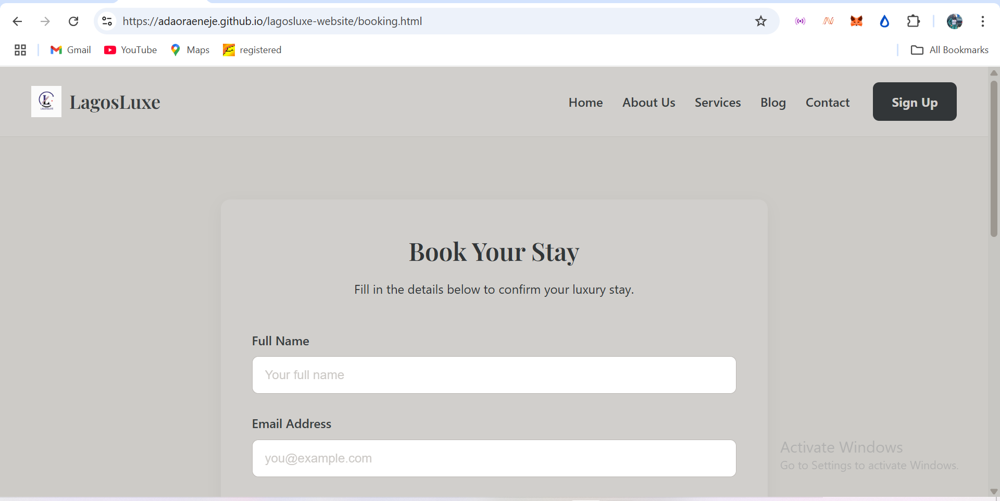
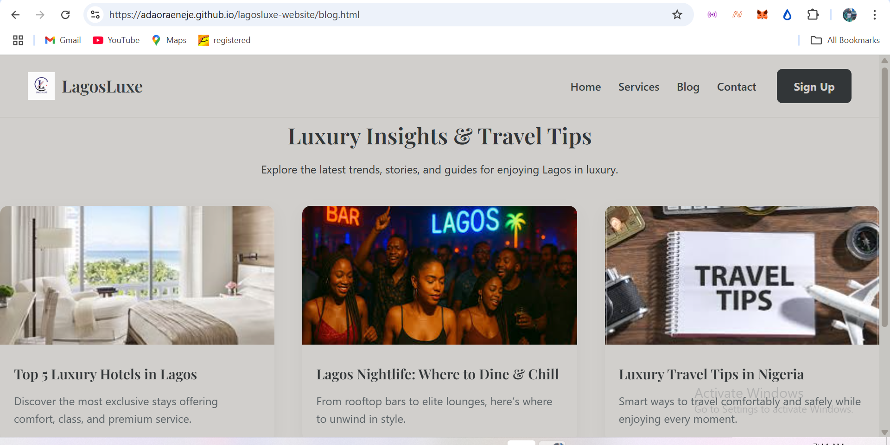

# LagosLuxe – Discover Luxury, Comfort & Style in Lagos 
🔗 **Live Demo:** [View LagosLuxe Website](https://adaoraeneje.github.io/lagosluxe-website/)


**LagosLuxe** is a responsive front-end website for discovering and booking luxury hotel experiences in Lagos, Nigeria. Designed with a clean, elegant layout and enhanced with animations, this project showcases strong HTML, CSS, responsive design, and Git/GitHub skills — making it ideal for modern front-end developer portfolios.

---

##  Table of Contents

- [About the Project](#about-the-project)
- [Key Features](#key-features)
- [Screenshots](#screenshots)
- [Technologies Used](#technologies-used)
- [Folder Structure](#folder-structure)
- [Setup Instructions](#setup-instructions)
- [Author](#author)
- [License](#license)

---

##  About the Project

###  Case Study: LagosLuxe – Elevating the Luxury Hotel Booking Experience

 ####  Overview
LagosLuxe is a responsive, front-end hotel booking website built with HTML, CSS, and a touch of JavaScript (Swiper.js). It was designed to offer users a premium, visually immersive experience for discovering and booking luxury hotels in Lagos, Nigeria.

This project was developed as part of my portfolio to showcase not just technical skills, but also my understanding of user interface design, responsive development, and project structuring using Git and GitHub.

####  Problem Statement
Travelers and locals looking for luxury hotel stays in Lagos often struggle to find platforms that feel truly premium, trustworthy, and user-friendly. Many existing websites are cluttered, outdated, or not optimized for mobile — creating friction in an experience that should feel seamless and indulgent.

####  Goal
To design and build a modern, elegant, and responsive website that captures the essence of luxury, offers intuitive navigation, and provides core features like booking, service information, and a contact form — all without any backend.

####  My Role
- UI/UX Designer  
- Front-End Developer  
- Git/GitHub Workflow Manager

####  Tools & Technologies
- **HTML5** – Semantic structure and accessibility  
- **CSS3** – Styling, grid/flexbox layouts, animations, media queries  
- **Swiper.js** – Image slider for homepage hero  
- **Google Fonts** – Typography for luxury branding  
- **VS Code** – Development environment  
- **Git & GitHub** – Version control and project hosting  
- **GitHub Pages** – Live deployment

---

##  Key Features

- ** Responsive Design** – Tailored layout for mobile, tablet, and desktop using media queries  
- ** Booking Page** – Clean, styled form for check-in/check-out with room options  
- ** Services Page** – Showcases concierge and hotel services with icons and structure  
- ** Blog Layout** – Placeholder design for lifestyle/travel blog content  
- ** Contact Form** – Accessible and styled inquiry form  
- ** Auth Pages** – Simple, styled login/signup mockups  
- ** Branding** – Elegant color palette and luxury fonts for visual identity

---

##  Outcome & Results

- ✅ Fully functional static front-end website  
- ✅ Mobile-first and responsive across devices  
- ✅ Clean file structure and organized codebase  
- ✅ Strong portfolio addition to demonstrate visual + technical frontend skills

---

##  Reflection

Building **LagosLuxe** pushed me to balance **aesthetic elegance with technical precision**. From ensuring responsive breakpoints to selecting a font that reflects luxury, every design decision was intentional. I also sharpened my Git workflow by tracking progress and managing updates through the command line.

This project solidified my foundation in front-end development and showed me the power of **storytelling through design**.

---

---


##  Screenshots

###  Homepage  


###  Booking Page  


###  Blog Page  


---

##  Technologies Used

| Tech/Tool     | Purpose                               |
|---------------|----------------------------------------|
| HTML5         | Markup structure                       |
| CSS3          | Styling and responsive layout          |
| Swiper.js     | Image slider animation                 |
| Google Fonts  | Elegant typography (Playfair Display)  |
| Git & GitHub  | Version control                        |
| VS Code       | Code editing                          |

---

##  Folder Structure

LAGOSLUXE WEBSITE/
│
├── image/ # All media assets (JPGs)
├── index.html # Homepage
├── about.html # About Us Page
├── services.html # Services Page
├── booking.html # Hotel Booking Page
├── blog.html # Blog Page
├── contact.html # Contact Form Page
├── login.html # Login Page
├── Signup.html # Signup Page
├── service-details.html # Detailed view of service
├── style.css # Main stylesheet
└── README.md # Project documentation

yaml
Copy
Edit

---

##  Setup Instructions

To view the website locally:

1. **Clone the repository:**

```bash
git clone https://github.com/adaoraeneje/lagosluxe-website.git
Navigate to the folder and open the project:

bash
Copy
Edit
cd lagosluxe-website
Open index.html in your browser to explore the homepage.

⚠️ Note: This is a static front-end website with no backend/database integration.

 Author
Adaora Eneje
Front-End Developer
 Email: adaoraeneje@gmail.com
 GitHub: github.com/adaoraeneje
 Location: Lagos, Nigeria
 Actively seeking junior front-end developer roles or internships

 License
This project is open-source and available for:

Learning and practice

Personal portfolio showcase

Non-commercial use

If you’d like to collaborate, give feedback, or connect professionally — feel free to reach out via GitHub or email.

